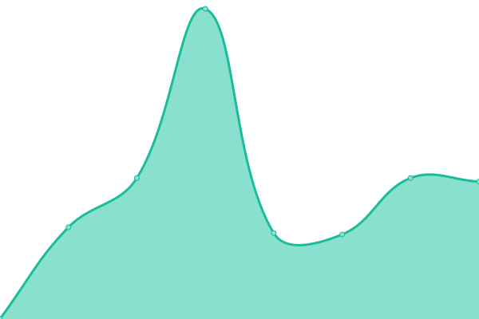
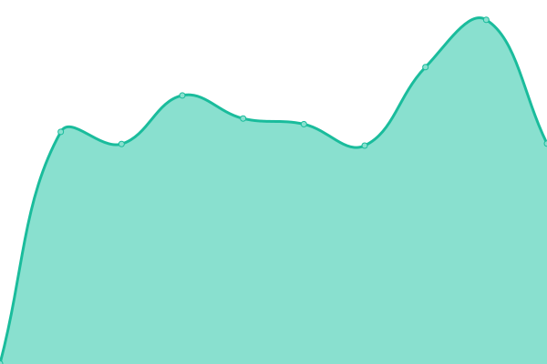

# [📈 Live Status](https://bklo94.github.io/upptime): <!--live status--> **🟧 Partial outage**

This repository contains the open-source uptime monitor and status page for [Brandon Lo](https://brandonkitlo.com/), powered by [Upptime](https://github.com/upptime/upptime).

With [Upptime](https://upptime.js.org), you can get your own unlimited and free uptime monitor and status page, powered entirely by a GitHub repository. We use [Issues](https://github.com/bklo94/upptime/issues) as incident reports, [Actions](https://github.com/bklo94/upptime/actions) as uptime monitors, and [Pages](https://bklo94.github.io/upptime) for the status page.

<!--start: status pages-->
<!-- This summary is generated by Upptime (https://github.com/upptime/upptime) -->
<!-- Do not edit this manually, your changes will be overwritten -->
<!-- prettier-ignore -->
| URL | Status | History | Response Time | Uptime |
| --- | ------ | ------- | ------------- | ------ |
|  Rutorrent | 🟥 Down | [rutorrent.yml](https://github.com/bklo94/upptime/commits/HEAD/history/rutorrent.yml) | 

 0ms
     
 | 

<a href="https://bklo94.github.io/upptime/history/rutorrent">0.00%</a>
    

|  qBittorrent | 🟥 Down | [q-bittorrent.yml](https://github.com/bklo94/upptime/commits/HEAD/history/q-bittorrent.yml) | 

 0ms
     
 | 

<a href="https://bklo94.github.io/upptime/history/q-bittorrent">0.00%</a>
    

|  VNStat | 🟥 Down | [vn-stat.yml](https://github.com/bklo94/upptime/commits/HEAD/history/vn-stat.yml) | 

 0ms
     
 | 

<a href="https://bklo94.github.io/upptime/history/vn-stat">0.00%</a>
    

|  Portainer | 🟩 Up | [portainer.yml](https://github.com/bklo94/upptime/commits/HEAD/history/portainer.yml) | 

 619ms
     
 | 

<a href="https://bklo94.github.io/upptime/history/portainer">0.00%</a>
    

|  Plex | 🟩 Up | [plex.yml](https://github.com/bklo94/upptime/commits/HEAD/history/plex.yml) | 

 463ms
     
 | 

<a href="https://bklo94.github.io/upptime/history/plex">0.00%</a>
    

|  Tautulli | 🟥 Down | [tautulli.yml](https://github.com/bklo94/upptime/commits/HEAD/history/tautulli.yml) | 

 0ms
     
 | 

<a href="https://bklo94.github.io/upptime/history/tautulli">0.00%</a>
    

|  Stash | 🟥 Down | [stash.yml](https://github.com/bklo94/upptime/commits/HEAD/history/stash.yml) | 

 0ms
     
 | 

<a href="https://bklo94.github.io/upptime/history/stash">0.00%</a>
    

<!--end: status pages-->

[**Visit our status website →**](https://bklo94.github.io/upptime)

## 📄 License

- Powered by: [Upptime](https://github.com/upptime/upptime)
- Code: [MIT](./LICENSE) © [Brandon Lo](https://brandonkitlo.com/)
- Data in the `./history` directory: [Open Database License](https://opendatacommons.org/licenses/odbl/1-0/)
